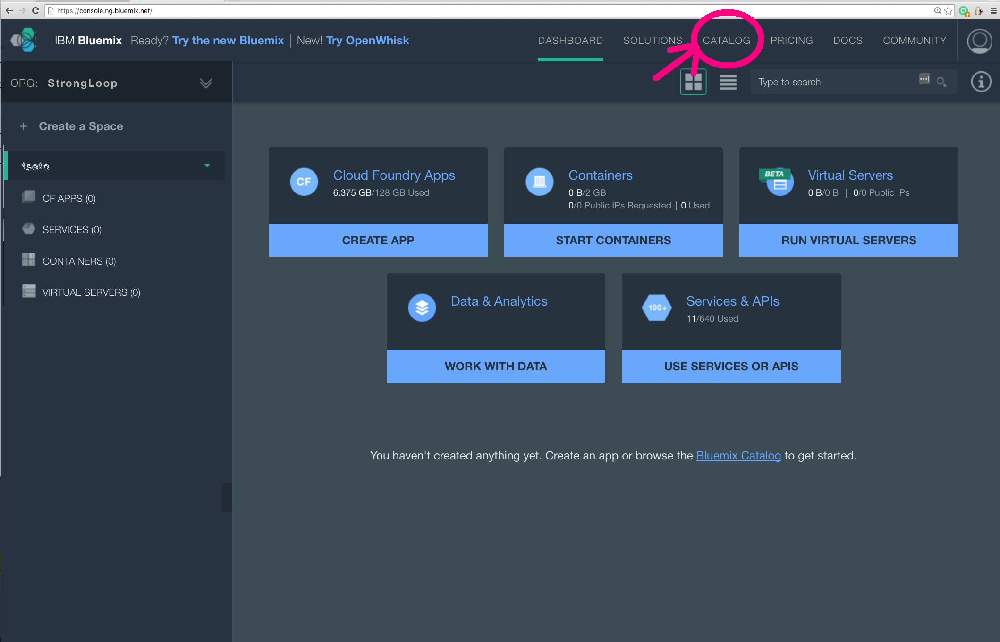

# sg-example-002-glob-pipeline

How to set up Globalization Pipeline service on Bluemix
(General Availability version)

# 1
Login to your account on https://console.ng.bluemix.net/ then go to your Bluemix Dashboard, then click *Catalog* tab.

# 2
Create *Language Translation* service under *Watson* catalog

# 3
Check the *Space* is correct and *CREATE*.

In a minute, the *Language Translation* service is created and its home page is shown.  Go ahead and click *DASHBORD* tab and go back to your dashboard page.

# 4
Confirm the *Language Translation* service tile has been created in your space.

# 5
Go to *CATALOG* again and scroll down to *DevOps* catalog.

Click the *Globalization Pipeline* service.  Note that *BETA* service might still exist, but it’ll be decommissioned shortly.  Please make sure to use the GA version.

# 6
On the *Globalizaiton Pipeline* dashboard, the default setting should be good.  Please confirm that the *Space* is correct and *App: Leave unbound* is set, then *CREATE*.

In 20 seconds – 1 min., the *Globalization Pipeline* dashboard will open.

# 7
On the *Globalization Pipeline* dashboard, click *Machine Translation Configuration* tab.

# 8
Under *Add Watson Language Translation Machine engine* pull-down list, select the *Translation* service you created in the step 3 and 4.  Make sure the *instance name* matches with the *Service name* you set in the step 3.

*Enable* it.

# 9
*Confirm*.

# 10
Go to *API Users* page.  There is one default Admin user. Click *New API User* button to create a new user with *Administrator* type.

# 11
Set *Display name* and *Administrator* type, then, *SAVE*.

# 12
Click the eye icon to open the user’s configuration page.

# 13
On the user configuration page, open the left command column by clicking the upper arrow.

# 14
Click *Service Credentials* command in the left command column.

# 15
Copy the credential JSON object notation and save it.  You can paste it directly to **strong-globalize/lib/local-credentials.json**.

